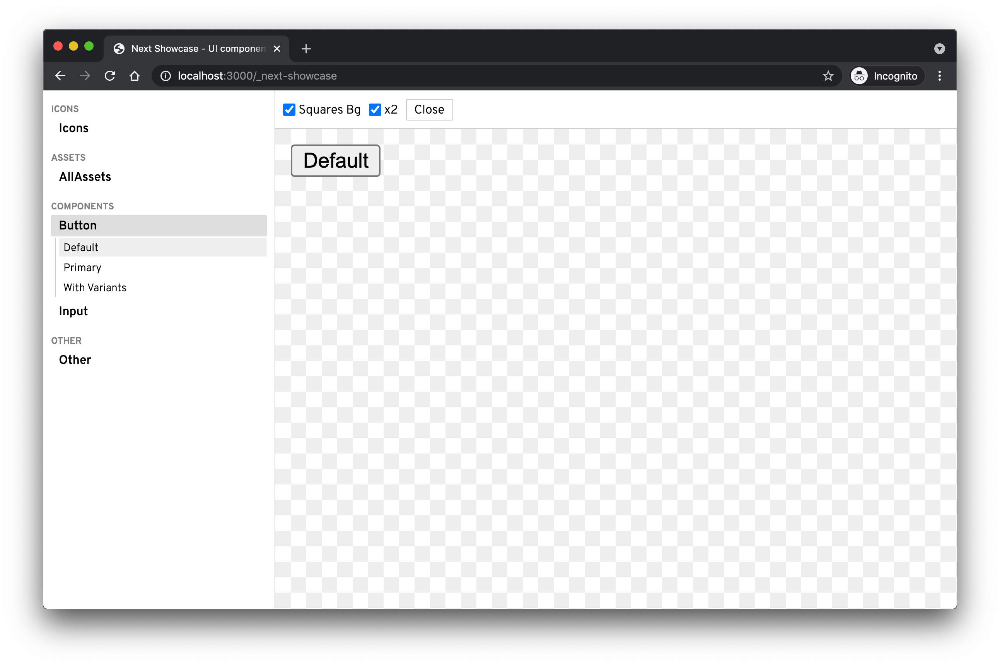

# @ginterdev/next-showcase

> Very simple and basic alternative for Storybook working on Next.js.



## Warning :warning:

1. **This tool is completely Next.js-based, so it cannot be used without it (for now).** It has potential for working with non-Next.js apps, though.
2. **For now I am just experimenting. I DO NOT recommend using it for anything that is not just having fun after hours.**
3. **If you have questions or proposals** use GitHub issues.

This package makes some assumptions:

- you are using **Next.js** (>= 9)
- you are using **Typescript** (>= 3.9)
- your pages directory is `process.cwd()/pages`

## Installation

```bash
yarn add --dev @ginterdev/next-showcase

# or

npm i -D @ginterdev/next-showcase
```

## Usage

### Step 1

Start your Next.js application in watch mode.

```bash
next dev -p 3000
```

### Step 2 (optional)

:warning: This has to be done ONLY if you have [custom `App` component](https://nextjs.org/docs/advanced-features/custom-app).

Wrap you custom `App` component with `withShowcase`. This will skip all specific stuff for your project implemented inside `getInitialProps` as well and your custom component. You don't want to render header or footer as part of showcase page.

```tsx
import { withShowcase } from '@ginterdev/next-showcase';

function App() {
  // Implementation ommitted.
  return ...;
}

export default withShowcase(App);
```

### Step 3

Create your first stories file inside `src` directory (relative to `process.cwd()`).

```tsx
import type { ShowcaseStories } from '@ginterdev/next-showcase';

// Import of `Button` is ommitted.

const stories: ShowcaseStories = {
  'My First Story': () => <Button />,
  'My Story With Dark Mode': {
    dark: true,
    story: () => <Button />,
  },
};

// Default export is important.
export default stories;
```

### Step 4

Finally run a watch server that will automatically update the showcase page whenever you add or modify some `*.stories.tsx` files.

```bash
npx @ginterdev/next-showcase

# Now go to http://localhost:3000/_next-showcase 🚀
```

---

Make sure to add `pages/_next-showcase` to your `.gitignore`.
